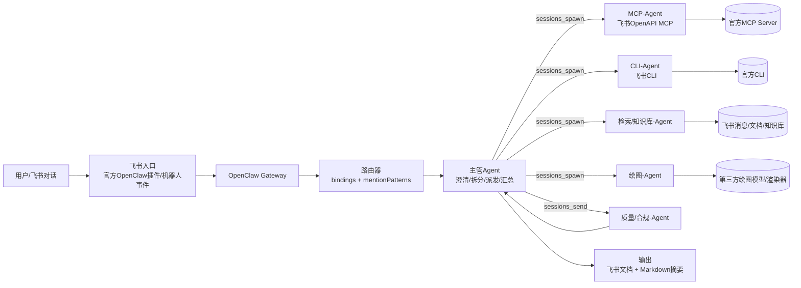
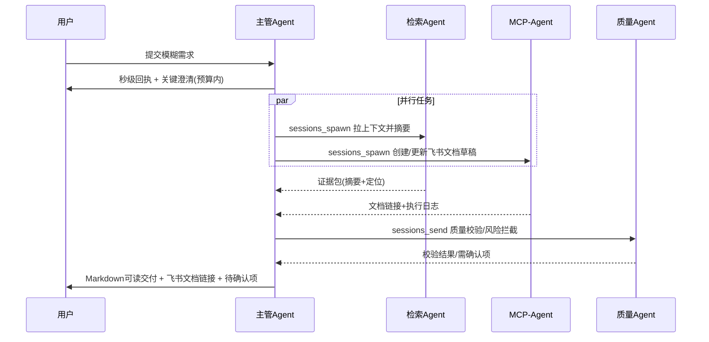

# OpenClaw 接入飞书生态的多 Agent 体系设计研究报告

## 执行摘要

本需求的本质是把“对话式需求澄清”与“可执行的企业协作能力（消息、文档、多维表格、日历、任务等）”合并成一个可控、可靠、低延迟的编排系统：主管 Agent 先快速回应并把模糊需求收敛到可执行任务，再把高耗时/高风险/高 token 的环节拆给专门子 Agent 并行执行，最后主管做二次加工输出可读文档（Markdown 等），同时避免无限多轮对话与 token 失控。实现上应优先复用 OpenClaw 已提供的多 Agent 路由、会话工具（跨会话消息、后台子任务）与“子 Agent 成本可控”的机制，再把飞书侧能力通过官方插件、官方 MCP、官方 CLI 三条“执行通道”组合成分层能力面。citeturn13view1turn13view5turn13view4turn9view0turn7view3

关键建议（按“能改变成败”的优先级）如下：

第一，采用“双通道执行面”而不是单一集成：  
- **常规交互与上下文获取**优先走飞书 OpenClaw 官方插件（直接读写消息/文档/多维表格/日历/任务等），让主管 Agent 能“看见工作现场”。citeturn2view4turn9view0  
- **结构化、可控的工具调用**优先走飞书官方 OpenAPI MCP（可按工具白名单启用、支持多种传输模式、支持用户身份 OAuth 登录拿 user_access_token），并把它封装成 MCP-Agent。citeturn7view0turn7view1  
- **高频、低 token、批量/脚本化操作**优先走飞书官方 CLI（“对人类与 AI Agent 友好”、命令经真实 Agent 测试、覆盖 200+ 命令与多业务域），并把它封装成 CLI-Agent。citeturn7view3turn7view2  

第二，主管 Agent 默认不直接连 MCP（最小权限），但提供“可切换直连 MCP”的开关：  
- 当任务是**短链路、低风险、且 MCP 端到端延迟显著高于内部转发**时，主管可直接调用 MCP 以省去一次子 Agent 往返；  
- 当任务是**长耗时/高风险/需要严格工具白名单/需要隔离凭证**时，坚持委派给 MCP-Agent/CLI-Agent，并用 OpenClaw 的会话工具异步回传结果。OpenClaw 的 `sessions_spawn` 天然非阻塞并返回 runId/childSessionKey，适合把耗时工作放后台；`sessions_send` 支持 fire-and-forget 或等待回复，并且系统级“交替回复”最多 5 轮，可天然抑制内部对话失控。citeturn13view5turn13view4  

第三，把“控制轮数与 token”当作架构指标而不是提示词技巧：  
- 内部协同尽量用**结构化结果协议**（每个子 Agent 输出带证据与结论的短 JSON/Markdown 片段），主管只做合并与二次表达；  
- 对外多轮对话采用“澄清预算”（例如最多 2 次追问），超过预算则明确假设继续推进，并在最终文档里列“已假设项/待确认项”。（这是为了减少轮数，而不是为了写得更全面。）  

第四，安全上把“飞书可写能力”和“本机/命令行能力”分层隔离：  
- OpenClaw 支持按 Agent 粒度配置沙箱与工具 allow/deny；并且每个 Agent 的认证文件在各自 `agentDir` 下独立保存，默认不共享凭证，符合最小权限与“爆炸半径”控制。citeturn13view1turn2view6  
- OpenClaw 官方安全清单明确强调：先锁定 DM/群组白名单与配对，再收紧工具策略/沙箱；避免公网暴露；只加载明确可信的插件。citeturn15view0  

（说明：你提到“用户提供的三个链接”，但在当前对话内容中未出现；下文以检索到的 OpenClaw/飞书官方资料与可公开访问的官方仓库/文档为主，并在末尾给出需进一步阅读的清单。）

## 系统架构设计

### 组件清单与职责边界

建议将系统拆成“对话编排层（主管）+ 执行专长层（子 Agent 群）+ 质量与风控层（校验/权限/审计）”。

主管 Agent（Orchestrator / Supervisor）  
职责是**快速响应**与**需求收敛**：把用户输入分解为可执行任务块、识别信息缺口并在“澄清预算”内追问、选择执行通道（插件/MCP/CLI/绘图）、并行派发与最终汇总成可读文档。其工具权限应偏“读多写少”：允许发消息/写草稿，但对不可逆写操作默认走“需确认”策略（后述）。OpenClaw 提供多 Agent 路由与每 Agent 工具列表，可把主管设为默认入口。citeturn13view1  

子 Agent 类型（建议至少包含这些“专门面”）  
- MCP-Agent：负责调用飞书官方 OpenAPI MCP（或远程 MCP）执行结构化工具调用，尤其是云文档/知识库/多维表格的创建与更新。官方 MCP 工具支持通过 CLI 参数指定启用工具清单（`--tools`）、指定 token 模式（tenant/user）、并可选择 stdio/streamable/sse 等传输方式。citeturn7view1turn7view0  
- CLI-Agent：负责调用飞书官方 CLI 完成高频低 token 的查询/批量操作/脚本化任务；官方 CLI 明确面向“人类与 AI Agents”，覆盖多业务域并强调结构化输出与对 Agent 友好的参数/默认值设计。citeturn7view3turn7view2  
- 绘图-Agent：负责调用第三方绘图大模型或渲染工具（如把 mermaid/PlantUML 转图片、生成架构图）。应当放在沙箱环境，且与飞书写权限隔离。  
- 检索/知识库-Agent：负责“取上下文而非带上下文”——从飞书消息、文档、知识库拉取必要材料并摘要成证据包，避免把全量原文塞进主对话窗口。飞书官方插件提供对消息/文档/多维表格/日历/任务等能力的直接访问，是它的首选数据面。citeturn2view4turn9view0  
- 校验/质量-Agent：负责一致性检查（事实冲突、结构完整性、Markdown 可读性、引用与待确认项），并对“高风险写操作”做二次把关（例如发群公告、覆盖文档正文）。  
- 权限/合规-Agent（可并入质量-Agent 或独立）：负责最小权限校验、敏感信息脱敏、日志策略检查；并与 OpenClaw 的 per-agent auth 分离原则对齐。citeturn2view6turn15view0  

### 消息总线与路由

外部入口（飞书 → OpenClaw）  
- 采用飞书 OpenClaw 官方插件作为主要接入：它由飞书开放平台团队维护，目标是把 OpenClaw Agent 与飞书工作区“无缝连接”，使其能直接读写消息、文档、多维表格、日历、任务等。citeturn2view4turn9view0  
- 若需要自建机器人事件回调链路，飞书事件订阅支持长连接或自建 HTTP Webhook 服务两种接收方式；长连接模式强调降低接入成本、适用于企业自建应用。citeturn10search3turn1search10  

内部总线（OpenClaw 内部的任务派发与回传）  
- 用 OpenClaw 的 `sessions_spawn` 承载“耗时任务后台化”：它总是非阻塞，立即返回 runId/childSessionKey，并在完成后把 announce 结果回投到请求者频道，天然适合“先回应、后交付”的产品体验。citeturn13view5turn13view4  
- 用 `sessions_send` 承载“跨会话/跨 Agent 协作消息”：支持设置 `timeoutSeconds: 0` 做 fire-and-forget；也支持等待回复；并且在获得回复后可进入最多 5 轮的交替对话（可提前 `REPLY_SKIP` 停止），这为“控制内部轮数”提供了硬上限。citeturn13view5  
- 用 OpenClaw 多 Agent 路由（bindings + mentionPatterns）把不同群聊/会话映射到不同 Agent：例如在群内使用 `@family` 这样的 mentionPatterns 强定向到指定 Agent，从而减少“主管被所有杂讯打断”。citeturn13view1  

### 状态管理

建议将状态分为三层（从“对话 token”中剥离出来）：

会话态（Session State）  
由 OpenClaw 维护：每个会话有历史与可见性边界；并可对 spawned 子任务形成树形可见性（默认 `tree`）。这决定了“主管看到多少、子 Agent 看到多少”。citeturn13view5  

任务态（Task Ledger）  
独立于对话存储（Redis/PostgreSQL 皆可）：记录 taskId、runId、负责人 Agent、依赖关系、超时/重试、最终产物链接（飞书文档 url、附件 file token 等）、以及“已确认/未确认假设”。其目的是让“系统能持续跑”而不是“靠对话记忆硬扛”。

产物态（Artifact State）  
把最终交付物当作“可增量更新的资源”：优先写飞书文档/多维表格，再由主管生成 Markdown 摘要（或反向：先 Markdown、再由 MCP/CLI 写入飞书）。飞书官方插件明确支持创建/更新/读取云文档以及多维表格等能力，适合作为产物载体。citeturn9view0turn2view4  

### 并行与回退策略

并行策略  
- 以“任务块”为并行单位：检索（拉上下文）/生成（初稿）/校验（QA）/工具执行（写入飞书）分离。  
- OpenClaw 子 Agent 的设计目标之一就是并行化“research/long task/slow tool”；同时文档明确提示每个子 Agent 都会消耗独立上下文与 token，因此应为子 Agent 配更便宜模型、把高质量模型留给主管整合。citeturn13view4  

回退策略（按优先级）  
- MCP 能力不足或工具未开放：若使用“远程 MCP”，官方说明“当前仅支持云文档场景，工具持续扩展中”，因此遇到消息/日历/任务等非文档场景时应自动切到官方插件或 CLI。citeturn6search3turn9view0turn7view3  
- 权限不足：优先引导走用户授权（OAuth），因为飞书官方插件与官方 MCP 都支持以用户身份授权后访问个人数据/执行操作。官方 MCP 的 `lark-mcp login` 明确用于用户身份登录并获取 user_access_token。citeturn7view1turn9view0  

### 权限与鉴权

飞书侧 token 分层（建议作为“权限面”的基本事实）  
- tenant_access_token：自建应用可通过接口获取，文档明确其有效期为 2 小时，并且请求需携带 app_id 与 app_secret。citeturn0search9  
- user_access_token：飞书文档说明这是 OAuth 令牌接口返回的用户访问凭证；调用前需先获取有效期约 5 分钟的授权码，并会返回 user_access_token 与 refresh_token。citeturn14search1turn14search13  
- 权限范围差异：飞书文档在权限说明中提示，某些订阅/访问在 tenant_access_token 模式下可能受限（例如文档变更订阅仅能感知 bot 作为拥有者/管理员的文档），需要用户身份权限才能覆盖更广的数据边界。citeturn0search5  

OpenClaw 侧的“每 Agent 凭证隔离”  
OpenClaw 文档明确指出：认证是 per-agent 的，每个 Agent 从自己的 `agentDir` 读取 `auth-profiles.json`，凭证不共享；不应复用 agentDir，否则会打破隔离。citeturn2view6  

## 任务分配与协同流程

### 任务拆分规则

拆分的目标不是“更细”，而是把任务映射到**最小必要权限**与**最低 token 成本**的执行面。建议采用以下判别维度：

- 是否需要写入飞书（写文档/发消息/改表）？若是，必须走“写入专门 Agent + 二次确认”路径（除非明确低风险，如写个人草稿）。飞书官方插件能力清单中包含“以你的身份完成工作（回消息、写文档、生成多维表格、创建文档等）”，意味着写入能力真实存在，必须以流程约束来控风险。citeturn9view0  
- 是否高耗时/慢工具（生成长文档、批量改表、调用绘图模型）？若是，必须后台化（`sessions_spawn`）并给用户“进度回执”，避免对话卡死。citeturn13view5turn13view4  
- 是否需要强结构化与可审计（批量写入、多步骤工作流）？优先 CLI 或 MCP，避免“纯自然语言+插件黑盒”。官方 CLI/官方 MCP 都提供参数化与工具白名单。citeturn7view3turn7view1  

### 指派策略

建议用“能力-风险-成本”三元组做路由选择：

能力匹配（必须满足）  
- 文档/知识库：MCP-Agent（可按 `--tools` 控制启用范围）或官方插件直连。citeturn7view1turn9view0  
- 消息/日历/任务/群聊上下文：官方插件或 CLI-Agent；官方 MCP 的工具覆盖范围会随版本变化，且远程 MCP 已声明阶段性仅云文档，因此不要把这类任务强依赖远程 MCP。citeturn9view0turn6search3turn7view3  

风险控制（决定是否需要二次确认/隔离）  
- “以用户身份发消息”属于不可逆且高外部性；官方插件文章特别提示：代发消息以你的名义发出、发出后即成事实，并建议“先预览再确认”。citeturn9view0  
- 对文档覆盖写、批量删改表记录、群公告等操作，必须由校验/合规 Agent 复核（包括权限范围、目标对象、影响面）。

成本控制（决定是否并行/是否直连 MCP）  
- 主管直连 MCP 仅用于短链路：例如“创建一个空白文档并返回链接”这类 1-2 个工具调用可完成的工作；  
- 一旦涉及多工具、多步骤、或需要补救（重试/回滚），就改走 MCP-Agent/CLI-Agent，并要求其输出结构化执行日志（命令 + 结果摘要 + 失败原因 + 建议重试参数）。

### 优先级、超时与重试

建议定义三档优先级（P0/P1/P2），并与超时策略绑定：

- P0（交互体验）：主管首响（TTFR）与澄清问题。目标是“秒级回执”，因此禁止等待慢工具；必须先 `sessions_spawn` 后回执。OpenClaw 的 `sessions_spawn` 非阻塞特性适合做这一点。citeturn13view5  
- P1（主要产出链路）：生成初稿、写入飞书草稿、汇总成 Markdown。超时可重试 1–2 次（指数退避），失败则降级为“给出本地 Markdown + 待手工写入指引”。  
- P2（增值项）：绘图、美化、附录、自动引用整理等；超时直接跳过或延后。

### 结果汇总与冲突解决

建议让每个子 Agent 输出固定结构（示意）：  
- 结论摘要（≤150 字）  
- 证据列表（引用飞书文档/消息/表格的定位信息）  
- 执行日志（工具名/命令、关键参数、返回码、耗时）  
- 风险提示（是否可逆、是否需要确认）  
主管汇总时做两类冲突处理：  
- 事实冲突：把相互矛盾的证据并排展示，并标记“需要用户拍板”的最小问题；  
- 方案冲突：按约束（时间/成本/权限/可维护）排序给出推荐，并把未选方案变成备选。

## 对话设计与 token 优化

### 多轮对话管理策略

对话的目标应是“把不确定性压缩到可执行”，而不是“把所有可能性问清”。建议采用：

澄清预算（外部轮数上限）  
- 默认最多 2 轮追问：第一轮确认产物与边界（要什么文档、给谁看、截止时间）；第二轮确认关键约束（权限/数据源/是否可写入飞书）。超过预算则主管明确假设并继续执行，把待确认项写入交付文档的开头（用户能一眼改）。  

内部轮数硬限制  
- 内部 Agent 协作尽量避免“长对话”，用 `sessions_send` 的 5 轮交替上限兜底，并优先用 fire-and-forget 让子 Agent 自主完成后一次性回传，减少 token 来回消耗。citeturn13view5  

### 摘要、压缩与指令模板

把上下文拆成三块：  
- 稳定信息（组织/项目背景/固定约束）→ 写入“工作记忆”（外部存储）；  
- 进行中信息（当前任务树、已完成任务、待确认项）→ 写入任务台账；  
- 对话历史（原始聊天）→ 只保留最近 N 条 + 关键摘要。

OpenClaw 文档对“子 Agent 成本”的提醒意味着：压缩不仅减少主管 token，也减少并行子任务的重复上下文传输；更适合把“资料全文”留在飞书文档里按需检索，而不是塞进提示词。citeturn13view4turn9view0  

### 上下文窗口管理与增量更新

建议采用“增量差分”而不是“全量重发”：  
- 每次只向模型提供：上次摘要 + 本轮新增事实/约束 + 当前要做的决策点；  
- 子 Agent 回传也只回传“差分”：新增证据与新增结论，不重复既有内容；  
- 当需要完整背景时，让检索/知识库 Agent 通过飞书官方插件拉取原文再压缩回传。citeturn9view0turn2view4  

### 选择 CLI 以降低 token 的工程化理由

飞书官方 CLI 的定位本身就强调对 AI Agents 友好：命令经真实 Agent 测试、参数更简洁、输出更结构化以提升调用成功率；并覆盖多业务域与大量命令，因此在“高频查询/批量操作/数据搬运”场景通常比“把 OpenAPI schema 全塞进上下文然后让模型写请求”更省 token。citeturn7view3turn7view2  

## 接口与实现细节

### 与 OpenClaw 的集成点

多 Agent 路由与权限  
- 使用 OpenClaw 的 multi-agent routing：通过 bindings 将不同会话/群聊路由到不同 Agent；通过 `groupChat.mentionPatterns` 做群内显式路由；通过每 Agent 的 tools allow/deny 与 sandbox 配置实现最小权限。citeturn13view1  
- 每 Agent 凭证隔离：每个 Agent 读取自己目录下的 `auth-profiles.json`，不要复用 agentDir；需要共享时复制文件而非共享目录。citeturn2view6  

后台任务与回调  
- `sessions_spawn`：用于后台执行（MCP 生成文档、CLI 批量操作、绘图），返回 runId 便于任务台账追踪，并在完成后回投 announce。citeturn13view5turn13view4  
- `sessions_send`：用于主管与子 Agent 的命令下发与结果拉取；可设 `timeoutSeconds: 0` 做异步，也可等待回复；交替对话最多 5 轮便于控 token。citeturn13view5  

### 与飞书官方插件的集成点

官方插件能力与安装/授权入口  
- 飞书官方文章给出了插件能力清单：消息读取/发送/搜索、云文档创建/更新/读取、多维表格增删改查、日历日程管理、任务管理等，并强调可通过用户授权以“你的身份”操作。citeturn9view0  
- 安装命令示例：`npx -y @larksuite/openclaw-lark install`；安装后可在飞书对话中 ` /feishu start` 验证、`/feishu auth` 批量授权。citeturn9view0turn2view4  

实现建议  
- 把插件当作“数据面+轻执行面”：主管 Agent 可用它快速读取上下文与写入草稿，但对高风险写操作仍走专门 Agent 与确认流程。原因是官方插件文章明确提示“代发消息不可逆”与“先预览再确认”。citeturn9view0  

### 与飞书 MCP 的集成点

官方 OpenAPI MCP Server（本地/自托管）  
- 官方仓库明确这是飞书/Lark 官方 OpenAPI MCP 工具（Beta），把飞书开放平台 API 封装成 MCP tools，面向文档处理、会话管理、日程等自动化场景。citeturn7view0  
- CLI Reference 明确：`lark-mcp login` 用于用户身份认证并获取 user_access_token；`lark-mcp mcp` 支持指定启用工具清单（`--tools`）、工具命名风格（snake/camel/dot/kebab）、token 模式（auto/tenant/user）、以及传输模式（stdio/streamable/sse）。citeturn7view1  

远程 MCP（平台托管）  
- 官方文档页面在“支持工具列表”中提示：远程 MCP 目前仅支持云文档场景，工具持续扩展中。因此架构上应把远程 MCP 视为“文档专用加速通道”，其余能力默认走插件/CLI。citeturn6search3turn9view0turn7view3  

MCP 的协议层假设（便于做工程选择）  
- MCP 是连接 AI 应用与外部系统的开放标准；并定义了包含 Streamable HTTP 等传输方式的规范。选择 stdio vs streamable/sse，决定了你是“本地子进程低延迟单客户端”还是“HTTP 服务多客户端/可横向扩展”。citeturn18search1turn18search2turn7view1  

### 与飞书命令行的集成点

官方 CLI 的能力边界  
- 官方仓库描述：这是飞书/Lark 官方 CLI，面向人类与 AI Agents，覆盖多个业务域、200+ 命令、并提供多套 Agent Skills；并强调“每个命令都经真实 Agents 测试、参数简洁、输出结构化”。citeturn7view3  
- 初版发布说明列出核心命令：`lark api`（调用任意 OpenAPI）、`lark auth`（完整 OAuth 流程与 scope 管理）、`lark config`、`lark schema`。citeturn7view2turn14search12  

集成方式  
- 在 OpenClaw 中将 CLI-Agent 置于“允许 exec 但必须沙箱”的环境；只开放白名单命令（例如 `lark api`/`lark auth status`/特定业务命令），并对写操作加确认门。OpenClaw 支持每 Agent 工具 allow/deny 与沙箱隔离。citeturn13view1turn2view6  

### 必要 API 调用示例（示意）

获取 tenant_access_token（自建应用）  
```http
POST /open-apis/auth/v3/tenant_access_token/internal HTTP/1.1
Content-Type: application/json

{
  "app_id": "cli_xxx",
  "app_secret": "xxx"
}
```
该 token 文档说明有效期 2 小时，适合服务端“应用身份”调用；系统应在任务台账层做缓存与到期刷新。citeturn0search9  

获取 user_access_token（OAuth 令牌接口，需先拿授权码）  
```http
POST /open-apis/authen/v1/oidc/access_token HTTP/1.1
Content-Type: application/json

{
  "grant_type": "authorization_code",
  "code": "xxx"
}
```
飞书文档说明该接口会返回 user_access_token 与 refresh_token，并提示授权码有效期约 5 分钟；因此“需要用户身份写入/读取个人资源”的链路必须包含授权与刷新逻辑。citeturn14search1turn14search13  

事件订阅回调安全（Encrypt Key）  
飞书事件订阅文档提示：配置 Encrypt Key 时平台推送事件会加密，建议配置以提升数据安全性。citeturn10search19  

（注：消息发送等具体业务 API 可通过官方 MCP 工具名或 CLI `lark api` 统一覆盖；官方 MCP 高级配置文档举例包含 `im.v1.message.create` 等工具名，适合在 MCP-Agent 层做工具白名单。citeturn6search11turn7view1）

## 性能可靠性与安全合规

### 并发模型、限流与监控指标

并发模型  
- 入口单线程快速回执：主管 Agent 只做“澄清/拆分/派发/回执”。  
- 执行层并发：MCP-Agent、CLI-Agent、绘图-Agent、检索-Agent 全部通过 `sessions_spawn` 后台跑，主管通过 runId 拉取状态并在完成时汇总。citeturn13view5turn13view4  

限流（建议）  
- 以“租户+用户+工具面”三维限流：例如文档写入与消息发送单独限流；绘图模型单独限流。  
- 以“token 预算”限流：每个任务树设上限，超过则降级（先出短版摘要，长版异步补齐）。

监控指标（最小集合）  
- TTFR（首响时间）、E2E 完成时间（按任务类型分桶）  
- 子 Agent 队列深度、单任务 spawn 数量  
- 工具成功率（MCP/CLI/插件分别统计）、权限不足错误率  
- token 消耗（每任务树、每 Agent、每工具调用）  
- 写操作审计：哪些操作触发“需确认门”，用户确认率与拒绝率

### SLA 建议与不同规模配置权衡

在未给定并发/延迟/预算/模型的前提下，建议按规模给出可落地的目标与取舍（“为什么这样配”比数字本身更重要）：

| 规模 | 典型并发用户/群 | 推荐执行面 | 并行策略 | 延迟/成本取舍 |
|---|---:|---|---|---|
| 小 | 1–20 | 官方插件为主，CLI/MCP 用于少量写入 | 子 Agent 并发 ≤3；能串行就不并行 | 追求低维护：少队列少状态；宁可稍慢也要稳定可解释 |
| 中 | 20–200 | 插件 + CLI 双主线，MCP 专注文档/结构化写入 | 子 Agent 并发 3–10；任务台账必配 | 追求“可控吞吐”：用 CLI 降 token；MCP 工具白名单降风险citeturn7view3turn7view1 |
| 大 | 200+ | 三通道齐全：插件（上下文）、CLI（批量）、MCP（结构化） | 子 Agent 并发 10–50；引入消息队列与分布式任务 | 追求“可扩展”：HTTP/Streamable MCP 更易水平扩展；但网络与鉴权开销更高，需要更强观测与熔断citeturn18search2turn7view1 |

（这里的关键权衡：OpenClaw 文档明确“子 Agent 各自消耗上下文与 token”，并建议子 Agent 用更便宜模型；因此规模越大越要控制 spawn 数与上下文大小。citeturn13view4）

### 测试用例建议

核心用例（覆盖最容易翻车的链路）  
- 路由正确性：不同群/不同 mentionPatterns 是否路由到正确 Agent。citeturn13view1  
- 权限缺失：缺少 user_access_token 或 scope 时，是否能自动引导授权并重试。citeturn7view1turn14search1  
- token 到期：tenant_access_token 2 小时到期、user_access_token 刷新链路是否可恢复。citeturn0search9turn14search13  
- 并发退化：绘图模型超时、MCP 服务不可用、CLI 返回非 0 时，是否正确熔断并走回退通道。  
- 写操作确认：所有不可逆操作是否被拦截到“预览→确认→执行”。（与官方插件风险提示一致。）citeturn9view0  

### 数据隐私、日志策略与权限最小化

数据与权限的底线  
- 飞书安全白皮书强调：数据传输使用加密链路（HTTPS/WSS 等）以及云文档服务加密传输；并强调数据访问需要数据所有者显式授权、员工访问被限制与审计、操作有详细日志与审批审计。系统在设计上应对齐这种“显式授权 + 可审计”的原则。citeturn16view0turn16view1  
- OpenClaw 侧：官方安全指南把“先锁群/私聊白名单、再收紧工具与沙箱、避免公网暴露、只加载可信插件、文件权限不可 world-readable”等列为高优先级审计项。你的多 Agent 体系应把这些做成默认配置而不是运维手册。citeturn15view0  

日志策略（建议）  
- 默认不记录原文内容，只记录：任务元数据、工具名/参数摘要、返回码、耗时、产物链接（或脱敏 token）、以及“用户确认记录”。  
- 专门对“以用户身份写入”的操作做审计事件（who/what/where/when），便于满足企业内控。  

## 部署运维与设计示例及资料清单

### 容器化、扩展与故障恢复

容器化与隔离  
- 优先使用 OpenClaw 的 per-agent 沙箱与工具策略：把 CLI-Agent、绘图-Agent 放进严格沙箱（必要时每 Agent 单独容器），把主管放在相对受限但可读上下文的位置。OpenClaw 文档给出了每 Agent sandbox/tools 配置示例。citeturn13view1turn2view6  

备份与恢复  
- 备份对象应围绕“凭证与状态”而不是“聊天记录全文”。OpenClaw 安全页给出了凭证/allowlist/auth 等关键路径映射，可直接作为备份清单基线。citeturn15view0  

### 设计示例

#### 示例一：模糊需求 → 并行检索/生成 → 写入飞书文档 → 输出 Markdown

场景：用户在飞书群里说“帮我做一份项目复盘（含时间线、问题清单、行动项），并在飞书文档里生成；顺便画一张流程图”。

任务分配与消息流（含超时与回退）

| 步骤 | 负责人 | 动作与通道 | 超时/重试 | 回退策略 |
|---|---|---|---|---|
| 首响与澄清 | 主管 Agent | 1) 回执“已开始”；2) 追问复盘对象/时间范围/受众（澄清预算第 1 轮） | 5–10s | 若用户不答，按最近一周+群内项目名假设推进并标注待确认 |
| 拉上下文 | 检索/知识库-Agent | 用官方插件拉取相关群历史、关联文档、日程纪要并摘要成证据包 | 60s，重试 1 次 | 插件不可用则改用 CLI 查询/导出（若已配置）citeturn9view0turn7view3 |
| 生成初稿 | MCP-Agent | 用官方 MCP 创建复盘文档草稿（工具白名单仅 docx 相关） | 120s，重试 1 次 | MCP 不可用则先产出本地 Markdown，后用插件写入草稿citeturn7view1turn6search3 |
| 绘图 | 绘图-Agent | 生成流程图（mermaid → 图片或外部绘图模型） | 90s，不重试 | 超时则只保留 mermaid 文本版本 |
| 质量校验 | 质量-Agent | 检查行动项是否可执行、冲突是否标注、Markdown 可读性 | 30s | 失败则降级为“短版摘要 + 待补清单” |
| 汇总交付 | 主管 Agent | 1) 汇总成 Markdown；2) 给出飞书文档链接；3) 列待确认项 | 20s | 文档写入失败则只发 Markdown，并提示稍后补写 |

（实现要点：检索/MCP/绘图应全部 `sessions_spawn` 后台跑，主管用 runId 聚合；避免主线程等待慢工具。citeturn13view5turn13view4）

#### 示例二：主管可选“直连 MCP”以节省延迟

场景：用户说“给我建一个《周报》文档模板，包含‘本周进展/下周计划/风险与支持’三节”，只需一次创建与写入。

| 决策点 | 主管 Agent 选择 | 为什么 | 风险控制 |
|---|---|---|---|
| 是否直连 MCP | 若启用“直连开关”，主管直接调用 MCP 创建文档 | 任务为 1–2 个工具调用，子 Agent 往返会引入额外延迟 | 仍要求“先预览后确认写入”，避免误写到错误空间 |
| 是否委派 MCP-Agent | 默认委派 | 便于工具白名单与凭证隔离，审计更清晰 | MCP-Agent 输出执行日志与文档链接供主管二次加工 |

该开关的技术前提是官方 MCP 支持通过 `--tools` 选择启用工具、并可指定 token 模式；同时 MCP 传输支持 stdio/streamable/sse 等，从而可以在本地低延迟或服务化扩展之间切换。citeturn7view1turn18search2  

### Mermaid 架构图与流程图





### 优先参考资料与需进一步阅读的关键文档清单

飞书 × OpenClaw 官方集成（优先）  
- 飞书官方插件介绍与能力/风险提示（官方博客文章）。citeturn9view0  
- 飞书官方 OpenClaw 插件仓库（OpenClaw Lark/Feishu Plugin）。citeturn2view4  

OpenClaw 多 Agent 与会话编排（优先）  
- 多智能体路由与每 Agent 沙箱/工具策略示例。citeturn13view1  
- Session Tools（`sessions_send` / `sessions_spawn` 的语义与限制）。citeturn13view5  
- Sub-Agents（并行目标与 token 成本提示）。citeturn13view4  
- OpenClaw Security（审计清单、凭证路径映射）。citeturn15view0  

飞书 MCP（优先）  
- 飞书官方 OpenAPI MCP 仓库与 CLI 参考（login、tools 白名单、token-mode、传输模式）。citeturn7view0turn7view1  
- 远程 MCP 支持工具列表（判断能力覆盖边界，避免错误依赖）。citeturn6search3  

飞书 CLI（优先）  
- 飞书官方 CLI 仓库与发布说明（核心命令 `lark api/auth/config/schema`）。citeturn7view3turn7view2  

通用协议层（MCP 规范，便于做传输与部署决策）  
- MCP Getting Started / Specification / Transports（Streamable HTTP 等）。citeturn18search1turn18search2  

安全与合规（用于落地评审）  
- 飞书安全白皮书（数据传输加密、授权访问与审计）。citeturn16view0turn16view1  
- 飞书开放平台安全管理/稳定性安全要求（作为服务商/企业落地的合规基线，建议纳入评审清单）。citeturn14search2turn14search18