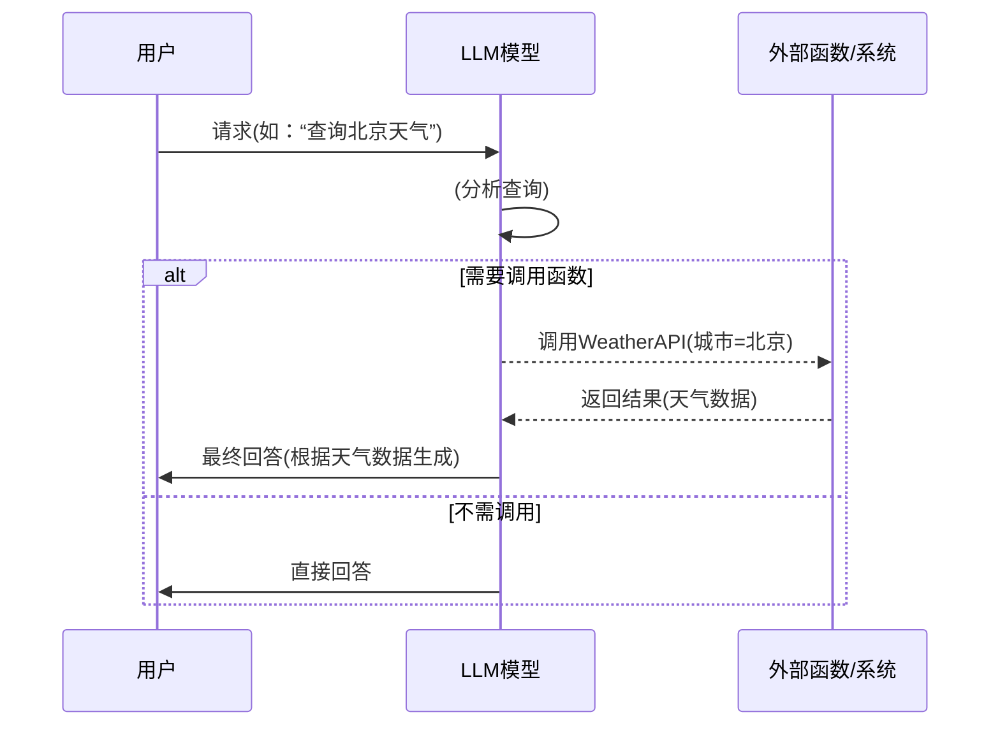

# 执行摘要  
随着大型预训练模型（LLM）的兴起，业界涌现出一系列新术语和概念，用以描述人机交互、模型训练、智能体架构及安全防护等各方面技术。本文梳理了常见的概念（如提示工程、链式思考、函数调用、微调、RLHF 等）和新兴术语（如驾驭工程、智能体、Claw、MCP、RAG、技能包、工具调用等），并对其通俗定义、主要作用、使用场景、操作示例及原理进行了详细阐述。此外，还讨论了每项技术的专业架构或算法细节，并提出了相关风险与对策建议。报告末附有对比表格及检索索引，便于快速查阅。  

## 术语详解  

### Prompt Engineering（提示工程）  
**定义（通俗）：** 提示工程就是设计和优化给LLM的输入提示，使模型能更好地完成特定任务的艺术或技术。通俗地说，它是用人类语言“编程”来控制大模型输出的方法【9†L62-L69】【11†L1051-L1055】。  
**作用与场景：** 通过巧妙组织问题、指令、示例等，可以提高模型回答的准确性和相关性。常用于聊天机器人、自动摘要、文本生成等场景，尤其是在ChatGPT或GPT-4 API等对话系统中指导模型行为、设定角色或风格时。  
**使用示例：** 比如，在提示末尾加上“请逐步解释你的思路”可以引导模型输出“链式思考”过程；在指令中明确“禁止讨论政治敏感话题”可以增加回答安全性。实践中可反复实验提示词的措辞和结构，并通过Few-shot示例来强调要求。  
**基本原理（通俗）：** 模型本质上是统计语言模型，输入提示相当于“场景设定”和“程序输入”，它决定了模型从何处出发及怎么“思考”。精心设计的提示能显著影响最终生成的内容。  
**专业原理补充：** 从技术角度看，LLM通过自回归机制对每个词元（token）生成概率分布，提示内容会调节这种分布。提示的关键要素包括系统指令（system prompt）、用户指令和示例（few-shot/zero-shot示例）、格式化约束等。提示工程常用的方法有Chain-of-Thought提示、树式推理（ToT）等，通过引导模型展现中间推理步骤提高性能【43†L49-L52】。  
**风险与建议：** 提示敏感度高，稍有措辞不同可能导致输出差异；过度复杂的提示会增加成本或导致模型跳跃回答。建议使用明确简洁的语言，必要时利用提示调优工具链或保存高效Prompt库；同时监测模型输出，防止产生偏差或不可预期结果。  

### Harness Engineering（驾驭工程）  
**定义（通俗）：** 驾驭工程指的是围绕LLM构建运行环境、约束机制和反馈闭环的系统化工程实践，它不仅关注模型本身性能，更关注模型在系统中如何可靠运行【19†L36-L40】【16†L54-L61】。换言之，提示词是直接握缰绳的缰绳、检索增强（RAG）是马鞍，而驾驭工程则相当于整套马具和跑道，让强大的“野马”（LLM）被良好控制和引导【19†L59-L62】【16†L54-L61】。  
**作用与场景：** 在构建复杂自动化流程（如代码自动生成、企业自动化等）时，简单的提示往往不够可靠。驾驭工程解决的核心是“LLM出错怎么办”。比如，在一套AI驱动的自动客服系统中，需要监测回答质量、循环反馈给提示、预定义规则拦截敏感回答、记录对话日志供后续优化等，都是驾驭工程的工作。它通常体现在**Agent智能体的生产环境开发**中，如引入断言测试、外部验证、错误补救措施等。  
**使用示例：** 开发代码智能体时，对每次生成的代码执行自动化测试；运行LLM时实时监测关键指标并回滚异常输出；结合反馈机制持续改进提示模板等。具体方法包括：流水线式的数据质量监控、动态提示更新、沙箱隔离执行环境（如OpenAI Codex的执行环境）以及人类在环（HITL）校验。  
**基本原理（通俗）：** LLM虽然强大却会出现“过度自信”或“幻觉”现象。驾驭工程的核心思路是**发现问题就改造环境**：每当模型跑出不符合预期的结果，就通过软件或提示升级让它学会不再犯错【19†L47-L52】。相当于给LLM套上规则引擎、反馈回路、防火墙等，以保证其输出的稳定可靠【19†L36-L40】。  
**专业原理补充：** 驾驭工程本质是一种系统工程和软件工程方法论。在架构层面可类比操作系统：模型如CPU，提示为输入，而驾驭（context layer）则如OS，它需要管理内存、调度任务、提供工具接口、维护状态【16†L54-L61】。典型组件包括：提示模板管理、检索与事实验证模块、输出过滤器、质量监测与自动微调模块等。比如，Hashimoto (GitHub Copilot)等实际项目就强调“每次AI犯错都编写新测试，让其不再犯同样的错”，体现了闭环迭代的思想【19†L47-L52】。  
**风险与建议：** 驾驭工程需要额外投入，构建复杂环境时成本和维护难度显著增加。过度依赖程序化约束可能会限制模型灵活性。建议在关键场景中逐步引入核心元素（如基础监测、简单反馈），同时定期复盘和更新工程策略。此外，保证驾驭组件自身安全（例如API密钥的保护、执行环境的隔离）也是必要的防护举措。  

### AI Agent（AI 智能体）  
**定义（通俗）：** AI智能体是一种**自主执行任务的系统**。在大模型背景下，智能体通常由一个或多个LLM构成“大脑”，并配备工具接口、记忆模块、规划器等，让系统能够像“数字助手”一样主动处理复杂任务【23†L125-L133】【21†L69-L77】。  
**作用与场景：** 智能体可以自己分解任务、调用API或数据库、生成结果并反馈，是对话系统、虚拟助理、自动编程等场景的进阶。典型应用包括：Auto-GPT自动化任务、LangChain或RAGBots等流程化问答、个性化推荐、自动文档摘要生成等等。在企业里，AI智能体可整合多系统（ERP、CRM等）数据自主完成报告编写、客户咨询等业务。  
**使用示例：** 一个客服智能体接收用户问题后，先用LLM理解意图，再调用知识库检索模块获取相关文档，结合LLM进行生成回答；或在自动化办公场景里，智能体根据指令编写并执行代码，调用日程API安排会议等。开发者可以使用现有框架（如LangChain、AutoGen、Brax等）快速拼装智能体，将模型与各种工具（数据库、网络搜索、程序执行环境等）联通。  
**基本原理（通俗）：** 智能体的核心是“先思考再行动”：它用大模型进行决策（“规划”）和解释，再调用工具或自身生成最终执行结果【21†L69-L77】。与传统聊天机器人不同，现代智能体配备**记忆和连续性**，能将对话或任务拆分为多步动作并“记住”上下文，对话中途可多轮反复操作。  
**专业原理补充：** 从体系结构上看，智能体系统通常包括规划器（Planner）、执行器（Executor）和环境接口。规划器（可用较大LLM）生成动作序列或子任务，执行器（可用较小LLM或硬编码逻辑）落实这些动作并收集结果【70†L58-L61】。例如，Plan-then-Execute模式将**高层策略**（用来安排接下来的步骤）与**低层执行**分离【70†L58-L61】。智能体还可能包含记忆模块（长期存储历史经验）、反馈循环（对结果进行评估与纠正）、工具合成（自动调用外部函数/API）等。  
**风险与建议：** 智能体自主性强，但也带来明显风险：它可能基于错误信息行动，或者在复杂任务中无限循环。建议在设计时明确安全边界，比如设定执行权限（Least Privilege原则）、对关键步骤进行人工审查（Human-in-the-loop）、对外部调用进行限制（不要让其随意删除数据、发送邮件等），并记录动作日志便于审计和回溯。另外，需要监控连锁效应（一个Agent失败可能影响下游），采用失败隔离和故障恢复策略【70†L58-L61】。  

```mermaid
flowchart LR
  U[用户/系统] -->|任务请求| Planner[规划器 (LLM)]
  Planner -->|生成计划| Plan{任务计划}
  Plan --> Executor[执行器 (LLM/工具)]
  Executor -->|调用工具| Tool[外部工具/函数]
  Tool --> Executor
  Executor -->|汇总结果| U
  subgraph 智能体结构
    Planner & Executor & Tool
  end
  note left of 智能体结构: 规划器负责分解任务，执行器负责执行细分操作，工具为外部调用
```  

### Claw  
**定义（通俗）：** Claw是近期由业界提出的概念（由Karpathy等推广），指“智能体之上的常驻层级”。它类似于让AI智能体变得持续在线并具备记忆与日程管理功能的运行框架【25†L7-L10】【6†L98-L106】。通俗地说，如果LLM是“专家顾问”、智能体是“一次性工人”，那么Claw就是“办公室的常驻员工”：不下线、长期工作、有日程安排和长期记忆【25†L7-L10】。  
**作用与场景：** Claw使得AI智能体可以跨会话、跨任务持续运行。例如一个Claw层级的智能助理，可以记住之前的对话上下文、定期检查新的任务、主动汇报进度，并管理自身的运行时环境。典型场景包括24/7个人助理、企业级连续自动化工作流等——不需要每次重新启动新的Agent实例。  
**使用示例：** 实践中出现了诸如“OpenClaw”和“NanoClaw”等开源实现：OpenClaw是一个功能齐全但代码量庞大的常驻智能体框架，而NanoClaw是轻量版实现。使用时，开发者可以部署一个Claw服务，它不断运行并监听任务队列，内部集成多个Agent。当有新任务时，Claw负责调度合适的Agent并传递长期记忆上下文，最终汇总回报。  
**基本原理（通俗）：** Claw的核心思路是“常驻化和状态管理”。普通LLM助手只对当下输入作答，一旦回答完就结束；智能体可以连续多轮执行任务，而Claw则让智能体**永远在线**，保存长期状态，包括之前的会话历史、定时任务列表、工具状态等【25†L7-L10】。它实际上在**操作系统级别**提供服务：提供持久运行、定时器、事件总线等基础设施。  
**专业原理补充：** 在技术实现上，Claw通常包含：一个事件循环机制（调度任务）、持久化存储（记忆或数据库）、消息系统（不同Agent之间通信）、运行时隔离（如容器化）等【25†L7-L10】。设计者将Agent视为“workers”，Claw视为承载它们的“办公室基础设施”【6†L98-L106】。例如，NanoClaw通过严格的容器隔离和简化设计，仅包含必需组件，使得多Agent长期运行时更稳定安全。  
**风险与建议：** Claw虽然提供持续性，但也带来更高的安全风险：持久化运行的Agent可能被恶意利用或遭受持续攻击。Karpathy曾指出，OpenClaw代码庞大且存在潜在安全漏洞【6†L84-L93】。建议采用细粒度权限管理（每个Agent限制访问范围）、定期安全审查、并在启动长期任务前进行人机确认。同时，考虑使用轻量化实现（如NanoClaw）减少复杂度。  

```mermaid
flowchart LR
  U[用户] -->|下达任务| Claw[Claw层 (常驻运行)]
  Claw -->|分派任务| Agent1[智能体1]
  Claw -->|分派任务| Agent2[智能体2]
  Agent1 -->|执行工具调用| Tool[外部工具/API]
  Agent2 -->|执行工具调用| Tool
  Tool -->|返回结果| Agent1
  Tool -->|返回结果| Agent2
  Agent1 --> Claw
  Agent2 --> Claw
  Claw -->|汇总结果| U
  note left of Claw: Claw 管理多个智能体的生命周期、记忆与任务调度
```  

### MCP（模型上下文协议）  
**定义（通俗）：** 模型上下文协议（Model Context Protocol，MCP）是一种针对AI应用的**标准化通信层**，用于统一管理LLM与外部工具、数据库、模板等之间的交互和上下文传递【27†L131-L139】。可以把它看作智能体内部的“通用接口规范”，确保不同组件之间的数据格式和通信方式一致。  
**作用与场景：** 在多智能体或多模块系统中，不同模块需要共享信息和调用工具，但如果没有统一协议很容易出错或混乱。MCP的提出就是为了应对：当一个复杂任务需要多个专业Agent配合时，通过MCP约定好的消息格式和流程让它们协同工作。比如，设计一套自动驾驶Agent，需要感知、规划、控制模块交互，MCP可规范它们之间如何传递上下文信息。  
**使用示例：** 开发者为Agent编写时，可以使用MCP提供的接口模板，例如统一的上下文消息结构（JSON或protobuf格式）和工具调用约束（如函数API声明），这样不同Agent或系统可以无缝集成。许多框架（如微软的Flowise、OpenAI Agents SDK等）会内置类似协议，以便Agent之间互相通告任务状态和工具使用信息。  
**基本原理（通俗）：** MCP的目标是“让不同AI组件说同一种语言”，即建立明确的消息格式和流程规则。这样，一个Agent在调用工具时可以把必要的上下文封装到MCP协议规定的数据包里，另一个Agent或服务就能准确解析执行【27†L131-L139】。  
**专业原理补充：** 从技术角度，MCP会定义一系列通信约束和消息结构，比如：上下文字段（当前任务信息、历史对话、用户配置等）、工具接口描述（API名、参数schema）以及错误反馈规范等【27†L131-L139】。这类似微服务中的API规范，但专门针对LLM及智能体。设计MCP时通常会采用可扩展的序列化格式（如JSON Schema、Protocol Buffers），并确定事件（消息）流程：例如，一个Agent完成子任务后向协调者发消息，MCP协议规定消息名称和字段含义，从而支持跨Agent协作。  
**风险与建议：** 虽然标准化减少了“车祸”几率，但也可能增加系统耦合度。如果所有组件都严格依赖协议定义，修改起来成本大。建议在设计时保持协议灵活性和向后兼容，比如用版本控制Schema；同时尽量利用成熟标准（如OpenAPI/JSON Schema）避免重复造轮子。并定期测试各方协议兼容性，防止由于协议冲突导致的通信故障。  

### Function Calling（函数调用）  
**定义（通俗）：** 函数调用是指让LLM在对话或生成过程中能够“产生一次调用工具的请求”【37†L47-L50】。也可称为工具调用，它允许开发者向模型描述一些可用的函数（或API）及其参数，当用户提问时，模型可以返回一段符合JSON格式的指令，指定调用某个函数并传递参数，而非直接生成文本回答【37†L47-L50】。随后应用系统根据这个指令真正执行函数，并将结果反馈给模型或用户。  
**作用与场景：** 函数调用使LLM具备动态访问外部知识和执行实时操作的能力，拓展了其静态训练数据外的功能边界。常见场景包括：查询实时数据（天气、股市）、调用内部数据库（查询订单、用户信息）、执行计算任务（数学运算、代码运行）、触发操作（创建日历事件、发送邮件）等。它在ChatGPT插件（Plugin）和各种Agent框架中得到广泛应用。  
**使用步骤/示例：** 开发者首先在对话系统中定义好函数的结构：包括函数名、描述以及参数的JSON Schema。然后将函数列表连同提示词一起发送给模型【37†L47-L50】。模型在生成响应时，如果认为需要使用某个函数，就输出相应的JSON指令。例如用户问“北京明天会下雨吗？”，模型看到已注册的天气API，就可能输出`{"name":"get_weather","arguments":{"city":"Beijing","date":"2023-..."},"tool_call":...}`。后台接收该JSON后执行实际API请求，再将结果（二次生成的描述或原文）返给模型，让其整合成自然语言回答。详细做法可参考OpenAI功能调用指南【37†L47-L50】。  
**基本原理（通俗）：** 函数调用基于模型内部的推理能力：模型学会分析任务需要，判断何时调用外部工具。它并不是真的“执行”代码，而是**生成调用指令**。通俗地说，当模型觉得自己无法直接给出答案时，它会“建议”去调用某个函数，然后返回这个调用结果。  
**专业原理补充：** 技术上，OpenAI等平台通过JSON Schema定义接口，模型输出必须严格满足该Schema【37†L47-L50】【74†L28-L31】。实现上通常使用“结构化输出”（Structured Outputs）来保证模型生成的JSON合法。模型在生成过程中会概率地在输出里插入特殊标记（如`tool_calls`字段）来表示函数调用；应用端解析后根据字段名称和参数调用相应函数【37†L47-L50】。这一机制使得LLM和代码或API连接成为可能，而不是简单的纯文本对话。  
**风险与建议：** 函数调用增加了系统复杂度：必须确保模型调用函数时参数正确且安全。例如，错误的参数或未校验的函数名可能导致调用错误或安全漏洞。建议始终使用验证步骤：在执行前检查Schema合规性，并对函数调用结果进行过滤。对敏感API（如权限操作）应进行额外审计或要求多步确认。模型有时可能“胡乱”调用函数，所以也需要在提示或过滤器中引导模型谨慎调用。  



### Skill（技能）  
**定义（通俗）：** “技能”是指一组打包的指令和资源，通常包括文本说明、脚本、模板等，用来指导LLM完成特定任务【39†L518-L526】。在OpenAI的生态中，技能由一个文件夹构成，以`SKILL.md`清单文件为核心，声明该技能的作用和用法，其他辅助文件则包含运行代码或示例数据【39†L518-L526】。  
**作用与场景：** 技能使复杂工作流程模块化、可重用。例如，公司可以为自动生成报告编写一个“报告技能”，其中包含数据获取逻辑、报告格式模板等；另一个团队则可复用这个技能，而无需重新设计整个流程。在ChatGPT插件或API中使用技能，可以让模型调用预先打包好的复杂流程，从而减小Prompt负担并便于版本控制。  
**使用示例：** 开发者创建一个技能包：包括一个 `SKILL.md`，详细描述技能功能（如“生成个人月度总结”），并附上Python脚本或Shell命令实现具体步骤。部署时，这个技能包可以上传至平台或容器环境，使得当模型需要进行相关任务时，能够“读到”该说明并执行相应脚本。OpenAI提供了官方文档和SDK支持技能的创建和调用【39†L518-L526】。  
**基本原理（通俗）：** 技能实际上是对一系列操作或工作流的抽象。它相当于给模型添加了一个“工具”，但这个工具不仅仅是一个API调用，而是一段完整流程或程序代码。在执行时，模型会根据Prompt选择调用哪个技能，并按照SKILL.md里的指引执行。  
**专业原理补充：** 技能的核心是`SKILL.md`清单文件，它包含结构化的元信息（如技能名称、描述、版本）和指令。OpenAI的执行环境会自动读取该清单，将技能的信息添加到系统提示中【39†L518-L526】。当模型决定使用某个技能时，它会调用环境提供的接口来加载并运行相关脚本。这种方式类似于微服务+文档驱动的动态扩展，允许在运行时引入新的功能而不需要重启主系统。  
**风险与建议：** 使用技能可能带来安全和维护成本：注入错误或恶意脚本可能被模型误调用。建议对技能包进行审查、签名和权限控制（仅允许受信任技能），并在设计SKILL.md时严格限定可执行内容。此外，技能版本管理很重要：当脚本发生变化时，要确保旧版和新版技能互不干扰，并确保对话环境加载的始终是正确版本。  

### Chain-of-Thought（思维链）  
**定义（通俗）：** 链式思考（Chain-of-Thought, CoT）是一种提示技巧，要求模型在回答前先一步步推理并展示中间步骤【43†L49-L52】。它模拟人类分解问题的思路，将复杂问题拆分为一系列逻辑推导过程，然后再得出结论。  
**作用与场景：** CoT有助于提升模型在需要逻辑推理和复杂计算任务上的表现和可靠性。常见应用包括数学题求解、多步推理题目、情景分析等。通过引导模型“先思考后回答”，往往可以明显减少直接输出错误答案或遗漏步骤的情况。  
**使用示例：** 用户可以在提示中附加说明，比如“请详细说明你的推理步骤”或者“先列出解题思路再给出答案”。例如，遇到题目“解二次方程 x^2-5x+6=0”，在Prompt最后加上“请一步步推导”可让模型先写出“设 x^2-5x+6=0，则 (x-2)(x-3)=0, 故 x=2或3”这样的过程【43†L58-L60】。  
**基本原理（通俗）：** 正常情况下，LLM直接预测结果，可能遗漏复杂步骤或凭直觉产生错误。CoT提示通过在对话中明确要求模型生成每一步的中间结论，使其隐含的“内部思维”显现出来【43†L49-L52】。这不仅提高了答案的准确性，还便于人类检查其过程。  
**专业原理补充：** CoT通常结合few-shot演示或特殊引导词使用。学术界研究发现，在较大的模型上（如GPT-4、PaLM-2），Chain-of-Thought可以显著提升推理能力【43†L66-L74】。从技术上看，这种方法实际上是在prompt内给模型设置新的次级目标：生成一系列相关文本作为推理链（类似多阶段生成）。高级技巧还包括：自洽（Self-Consistency）—模型多次生成推理链，并取多数答案；树状思考（Tree-of-Thought）—多路径探索思维分支。  
**风险与建议：** CoT提示会增加输出长度，可能导致超出上下文限制或增加计算成本。如果模型本身逻辑能力有限，长步骤推理也可能会“垃圾进垃圾出”，产生错误推论。建议对CoT结果加以验证或结合工具（如计算器、知识库等）使用，并对明显错误的推理链进行人工过滤或引导。  

### Tool Use（工具使用）  
**定义（通俗）：** 在LLM语境下，工具使用指的是让语言模型调用外部工具（API、数据库、搜索引擎、计算器等）来完成任务的能力【21†L87-L95】。通过调用工具，模型可以获得实时信息、进行精确计算或执行操作，超越自身仅凭训练数据生成文本的局限。  
**作用与场景：** 工具使用使AI系统具备了“行动”的能力，比如自动化办公中调用电子表格API、科研助手中调用文献检索、教育助手中运行Python代码等。它常与函数调用功能配合使用，是构建多模态代理或流水线式生成任务（如文档处理流程）的关键。  
**使用示例：** 例如，一个天气查询工具，模型在判断到询问天气时自动调用天气API并返回结果；或者一个数学工具，模型在需要加减乘除时调用内部计算器。开发者在系统设计中将各工具功能注册给模型（如将工具名、描述和参数schema提供给模型），模型根据上下文决定选择何时、如何调用【21†L87-L95】。  
**基本原理（通俗）：** 模型本身不能直接执行代码或API请求，但可以通过输出“调用指令”的方式间接使用工具。简而言之，工具使用的流程是：模型在生成过程中识别需要工具的场景，然后输出一个特定格式的调用请求，后台系统据此实际运行工具并将结果反馈回模型，从而完成任务。  
**专业原理补充：** 在技术实现上，常用的接口是OpenAI API的tools参数或类似概念。当工具被注册时，系统会将其作为可选动作告知模型【21†L87-L95】。LLM会根据概率决定是否输出特定的函数调用请求（类似前节函数调用所述）。工具调用结果可以再次作为模型输入的一部分，使得模型可以综合外部信息生成最终回答。多个框架（如LangChain、NeMo等）为工具使用提供了抽象层，使得模型与工具的集成更加简单。  
**风险与建议：** 误用工具可能产生错误或造成安全隐患（如调用破坏性API）。需要对工具调用参数做严格校验，对工具的功能进行权限控制。并监控模型对工具的调用频率，防止无限循环调用。确保模型理解调用失败的情况并做好降级处理（例如提示错误信息）。  

### Retrieval-Augmented Generation (RAG，检索增强生成)  
**定义（通俗）：** 检索增强生成（RAG）是一种框架，它让LLM在生成答案前**先检索外部知识库或文档**，再将检索到的信息融入提示来生成更准确、时效的回答【47†L44-L47】【50†L11-L13】。简而言之，就是“去查资料后再回答”，而不是单纯依赖模型训练时学到的内容。  
**作用与场景：** RAG应对LLM“知识截止”、“幻觉”等问题，使答案基于权威资料而非只靠训练权重。典型场景包括：企业内部问答（检索公司手册）、法律咨询（检索相关法规）、金融分析（接入实时市场数据）、学术问答（检索论文摘要）等。它已成为当前很多Chatbot和智能体系统的标配。  
**使用示例：** 一个实现RAG的系统流程：当用户提问时，先将用户的查询进行向量化检索，找出相关文档（可以是FAQ、PDF、数据库记录等）；将这些相关内容拼接到原始提示中；再将增强后的提示送入LLM，由模型基于这些“参考资料”给出回答【47†L44-L47】【50†L11-L13】。例如，提问“公司年会时间是什么？”时，系统会从内部政策文档中检索年会安排，然后附加到提示中生成答案。  
**基本原理（通俗）：** RAG的核心思想是**“开卷考试”**：模型“考试”前可以先读书。不同于只用训练时见过的“闭卷”，RAG允许模型检索知识，类似人类查阅参考资料后再回答。这样可以降低模型凭空编造（幻觉）的概率【50†L11-L13】。  
**专业原理补充：** RAG一般包含两个阶段：检索（Retrieval）和生成（Generation）。检索阶段使用向量数据库和语义搜索技术来找到与用户查询相关的文档片段【48†L21-L25】；生成阶段则将检索结果与查询一同送入生成模型，让模型在有“外部知识”的前提下生成回答【50†L11-L13】。常用技术包括：使用嵌入模型将文档存入向量库（如FAISS、ElasticSearch加向量索引）、使用余弦或点积计算相似度、对top-k结果进行重排序等【48†L23-L25】【50†L11-L13】。开源和商业工具如Haystack、LangChain的RAG模块、OpenAI的vector database等都支持一键构建RAG系统。  
**风险与建议：** RAG依赖检索数据质量，劣质或过时的文档可能误导模型。因此，需要定期更新知识库，清洗无关信息。此外，拼接大量文档到模型输入可能超长上下文，引入冗余内容。建议只检索最相关片段，并使用摘要或分块技术压缩内容。另外，由于RAG牵涉外部资源（数据库、API），需考虑权限和隐私，例如对敏感文档要有访问控制，并对公开内容进行脱敏处理。  

### Fine-Tuning（微调）  
**定义（通俗）：** 微调是指在已经预训练好的大语言模型基础上，用与特定任务相关的数据**进一步训练**模型参数的过程【53†L52-L53】。其目的是让模型在保留原有通用能力的同时，在某一领域或任务上表现更好【53†L52-L53】。  
**作用与场景：** 通过微调，可以把通用型LLM改造成对某领域数据有更深理解的定制模型。常见应用场景有：法律文档处理、医学诊断对话、金融分析报告等垂直行业；或者特定任务如对话机器人、情感分析、专业机器翻译等。企业或研究者会准备与目标任务相关的问答对、对话示例或文档摘要作为训练集，对模型做定向微调。  
**使用步骤/示例：** 微调通常包括：收集和清洗高质量的领域数据、将文本数据转换为模型输入格式（编码成词元）、设计训练流程（设置学习率、批大小、训练轮次等）、用监督学习方法继续优化模型参数。例如，AWS提供了针对中文客服场景准备对话日志对Assistant进行微调的实践指南【53†L52-L53】。实际操作时，可利用Hugging Face Trainer或OpenAI的微调API，将带标签的数据提交给大模型进行迭代训练。  
**基本原理（通俗）：** 预训练时模型学会了丰富语言知识和一般世界知识，但并不完全符合特定任务需求。微调相当于**再给模型做习题**，让它将部分权重调整到任务更相关的位置。简单来说，就是在原先“模型脑海”里注入更集中的专业知识，使其回答更贴近某类问题。  
**专业原理补充：** 微调过程本质上是将损失函数限定在特定任务上进行优化，一般仍采用自回归训练或交叉熵损失。为了避免过拟合大型模型，现代微调多用参数高效技术（如LoRA、Adapter、量化微调）来只调整部分参数【53†L52-L53】。训练过程中需要小心设置超参数：学习率太大会破坏原始知识，太小则收敛缓慢。成功微调后的模型会“牢记”训练数据的模式和风格，对类似任务输出更精准结果，但也可能忘记一些通用知识（灾难性遗忘）。因此，通常结合**少量检索增强**或定期回顾机制来平衡。  
**风险与建议：** 微调成本高（需要大量计算资源）且可能引入偏见（训练数据偏差直接影响输出）。建议：尽量使用高质量多样化数据，做好数据清洗；微调前评估现有模型在任务上的表现，若已有模型表现良好可考虑轻量方案（提示设计、RAG）；微调后要测试模型在边界情况的表现，防止过度优化导致性能意外下降。并留意版权和数据隐私问题，确保训练数据合法合规。  

### Instruction Tuning（指令调优）  
**定义（通俗）：** 指令调优是在监督方式下，使用由“指令-响应”对（Instruction, Output）组成的数据集对LLM进行进一步训练的过程。这种做法让模型更擅长理解并执行人类的自然语言指令【55†L47-L55】。它缓解了模型原本以预测下一个词为目标与“回答用户指令”目标之间的不匹配【55†L47-L55】。  
**作用与场景：** 指令调优使大模型从“语言专家”转变为“虚拟助理”，在多种任务上能够更可控地给出符合要求的输出。OpenAI的InstructGPT系列、Anthropic的Claude等都采用了指令调优使模型更符合用户意图。场景包括对话助手、智能问答、内容生成等，只要希望模型更遵从任务说明，就可以进行指令调优。  
**使用示例：** 指令调优数据集通常包含大量示例，如“Write a summary of the following article: [text]”→“expected summary”。实际应用时，可使用公开的指令数据集（如FLAN、InstructGPT的指令集、Alpaca等），或人工生成特定领域指令对模型进行微调。  
**基本原理（通俗）：** 指令调优其实也是一种微调，只是强调数据是“指令+答案”形式，直接训练模型按照人类提示去生成答案【55†L47-L55】。这样，模型学习到了“这就是期望的回答方式”，而不是仅凭上下文自主生成。  
**专业原理补充：** 从算法上看，指令调优使用的是监督学习，不涉及奖励模型（与RLHF不同）。优化目标仍是最小化语言模型的损失，但训练过程中通过指令数据集让模型参数朝更符合指令执行的方向更新。现代实践中也结合了多轮对话示例（让模型学会长对话中的指令跟随）和多任务学习（不同类型的指令混合训练）来提高泛化能力【55†L47-L55】。指令调优是LLM对齐（alignment）的一步，它确保模型在被问到指令时表现更可预测、更安全。  
**风险与建议：** 如果指令数据有偏差（如倾向某种风格或错误回答），模型会复制偏差；单纯指令调优可能使模型“过度循规”，在面对超出训练集范围的问题时表现不佳。建议在制作指令集时兼顾多样性，并在调优后做广泛评估。通常，指令调优会与RLHF结合使用：先进行SFT（即指令调优），再用RLHF优化细节，以得到更稳定且符合偏好的模型。  

### RLHF（Reinforcement Learning from Human Feedback，基于人类反馈的强化学习）  
**定义（通俗）：** RLHF是一种机器学习技术，它利用人类提供的反馈来优化LLM【57†L45-L47】【59†L1-L4】。其过程通常是：先收集一组人类对模型输出的偏好或评分，训练一个奖励模型，然后用强化学习算法（如PPO）驱动语言模型调整参数，使其输出更符合人类偏好的结果【57†L45-L47】【59†L1-L4】。  
**作用与场景：** RLHF的主要目的是让模型输出更“人性化”且符合社会价值观。例如ChatGPT在2003年4月版发布前就进行了RLHF，使其更愿意遵守用户指令、避免生成不当内容。场景包括任何需要模型更好地对齐人类期望的任务：对话生成、文本总结、推荐系统等。  
**使用示例：** 实施RLHF通常包括：让人类对模型生成的回答进行多选排序（哪个回答更好？），用这些偏好构建“奖励模型”；然后使用奖励模型和策略梯度方法来更新原始LLM。比如OpenAI的InstructGPT和ChatGPT就是用了数万条由人工评估的对话来训练奖励模型，最终通过强化学习让回答尽量被人喜欢。  
**基本原理（通俗）：** 传统预训练模型仅学习如何预测下一个词，而RLHF引入了人类偏好信号，告诉模型“哪些回答才是高质量的”。可以把它想象成训练一个宠物：给出好的回答后给予高分奖励，不好的回答不给分或惩罚。模型在训练过程中会逐渐倾向于生成更“讨好人类”的内容。  
**专业原理补充：** RLHF一般分为三个步骤：监督微调（SFT，用人类示例直接fine-tune）、奖励建模（训练一个小型模型来预测人类给定的评分）和策略优化（使用PPO等RL算法在奖励模型上优化LLM）【57†L45-L47】【59†L1-L4】。数学上，这涉及最大化累积奖励的目标，通常采用近端策略优化(PPO)算法。在工程上需要注意的是训练不稳定、奖励模型误差和模型崩溃（mode collapse）等问题。RLHF能有效提升模型在“难以明确定义评价标准”的任务中的表现，如生成有趣回答或符合伦理要求的内容【59†L1-L4】。  
**风险与建议：** RLHF过程依赖于人类评判，成本高且容易引入主观偏见（评判者的个人偏好会影响奖励模型）。训练过程中奖励函数若设计不当，可能导致模型走极端行为或输出过度迎合训练数据。建议采用多元化评审（多个评判者、不同意见），并在RL阶段设置约束（如截断极端更新）。同时，监控模型输出的多样性，防止“奖励模型过拟合”使输出千篇一律。此外，由于RLHF增加了训练循环，必须谨慎调试超参数，确保模型稳定收敛。  

### SFT（Supervised Fine-Tuning，监督微调）  
**定义（通俗）：** 监督微调是指使用带标签的数据集对预训练模型做进一步训练，以调整模型到新任务。它通常用于让模型更好地跟随指令和格式化输出【61†L85-L92】。与RLHF不同，SFT仅使用人类标注的（输入，期望输出）对进行优化，没有额外的奖励模型或RL步骤。  
**作用与场景：** SFT是构建“助手型”模型的基础步骤。比如ChatGPT系列的训练流程中，第一步就是收集大量示例对话数据（人工对话示例）对GPT模型进行SFT，使其学会基于指令生成对话。适用于任何领域适配：医疗诊断问答、技术文档摘要、语言翻译等，只要有对应的示例数据，就可以做SFT。  
**使用示例：** 用户准备好格式为 `[Instruction, Output]` 的数据集后，可调用开源库（如Hugging Face 的SFTTrainer【61†L85-L92】）进行训练。例如，用一个包含对话Q&A的中文数据集对LLM做微调，模型在SFT后就会更擅长该对话格式。在不少LLM课程或实践中，SFT一般是学习如何从头构建对话模型时的第一步。  
**基本原理（通俗）：** SFT直接让模型“模仿”示例：将所有示例中的期望答案作为目标，训练模型输出更接近人类写的结果。它没有强化学习的复杂性，只是单纯的监督学习。但通过大量实例，它可以让模型掌握生成相对固定格式或风格文本的方法。  
**专业原理补充：** SFT属于有监督学习范畴，常用交叉熵损失来微调模型权重。它可以看作是对预训练模型的第二阶段训练：第一阶段学习语言通用知识，第二阶段学习特定任务规律【61†L85-L92】。SFT往往需要配合验证集监测过拟合，并根据任务重要性调整训练策略。在实际链式训练（如SFT+RLHF）中，SFT通常是先行步骤，为RLHF提供更合理的初始策略。  
**风险与建议：** SFT依赖数据质量：如果标签有误或风格不一致，模型会学到错误范例。且过度微调可能导致模型失去通用能力（只擅长训练时形式）。建议：使用高质量、多样的数据，采用适当的正则化手段（如早停、数据增强）；对输出结果进行人工检查以评估微调效果，避免模型变得过度死板。  

### Context Window（上下文窗口）  
**定义（通俗）：** 上下文窗口（Context Window或Context Length）是指LLM在一次推理过程中能**同时处理的最大词元数量**【63†L22-L27】。更直白地说，就是模型“记住”的文字长度上限。  
**作用与场景：** 上下文窗口决定了模型一次可以看多长的输入或对话长度。对于需要处理长文档、长对话或长程依赖的任务（如全文翻译、漫长对话、代码库分析等），大窗口非常有用。随着新一代模型（如GPT-4-Turbo、Gemini）的出现，上下文窗口已从原先的几千词元提升到数万词元【63†L22-L27】。  
**如何使用：** 使用时需关注输入长度：如果用户提供的提示（包括历史对话和system提示等）超过窗口限制，模型只能截断或丢弃超出部分【63†L22-L27】。因此，在设计应用时要合理管理上下文，比如分块处理长文本、使用摘要代替整篇文章、多轮交互缩减历史等。新技术也允许给定标志（如在OpenAI的Responses API中启用长上下文模式）来利用更大的上下文。  
**基本原理（通俗）：** Transformer模型的自注意力机制计算输入序列中每对词元之间的关系权重。上下文窗口大小即限制了模型在任何时刻能够关注的词元总数【63†L22-L27】。当输入超过限制时，模型不得不舍弃一部分，使得早期信息“忘记”。  
**专业原理补充：** 上下文窗口被视作模型的“工作记忆容量”【63†L22-L27】。增加窗口长度可提升模型解决长依赖问题的能力，但代价是**计算成本呈平方增长**（注意力机制的复杂度与输入长度平方成正比）【63†L28-L29】。此外，窗口越大，模型越容易遭受对抗性攻击（如在前面注入一段恶意prompt影响整个对话）【63†L28-L29】。在工程实践中，可以使用混合检索与生成（RAG）的方法来绕过窗口限制：先检索摘要信息再生成。若需要极长记忆，也可结合外部记忆库或流式处理手段（如用于Gemini的流式上下文）。  
**风险与建议：** 依赖长窗口并不意味着完美：过长的输入会降低模型预测质量（信息太多时难以聚焦）【63†L28-L29】。过多无关内容也会浪费token预算。建议：仅保留相关上下文，使用检索和摘要技术减少无关token；在设计对话系统时，可设定策略分段清理对话历史，或者在用户长时间暂停后重置会话，以防模型陷入冗长背景记忆。  

### Tokenization（词元化）  
**定义（通俗）：** 词元化是将输入文本拆分为更小单元（词元，token）的过程。这些词元可以是一个字母、一个词的一部分、一个完整词，甚至一个常见短语【63†L47-L54】。LLM内部处理的最小语言单位是词元（它们被转换为模型可理解的数字ID）。例如英文“computer”可能被拆成“compu”、“ter”两部分词元，而中文往往一个字就是一个词元。  
**作用与场景：** 词元化是所有LLM处理文本的第一步，决定了输入如何映射到模型向量空间。正确的词元化能够提升模型对输入的理解。对应用开发者来说，需要根据具体模型（不同模型的词表不同）对输入进行切分并计算长度，确保不超出上下文窗口【63†L22-L27】。  
**基本原理（通俗）：** 词元化一般采用BPE（字节对编码）或Unigram等算法，将常用字符组合定义为单一词元，使得模型既不单纯以字母为单位也不以整词为单位，而是两者的折中。这降低了词典大小（减少少见词语问题）并提高模型灵活性。  
**专业原理补充：** 词元化策略会影响模型性能：效率高的词元化能让更多内容纳入上下文窗口，提高实际可表示信息量【63†L22-L27】【63†L47-L54】。不同语言的词元化效率也不同，例如汉语一个字常为一个词元，而英语常用词可以被一个词元编码。开发者可以利用开源工具（如HuggingFace Tokenizer）查看模型对特定输入的词元拆分情况。词元化后每个词元对应一个向量索引，将通过嵌入层映射为向量继续处理。  

### Embedding（嵌入）  
**定义（通俗）：** 嵌入是将非数值化的输入（如文本、图像、音频）编码为一组浮点数向量的技术。对于LLM来说，Embedding是将词元ID映射到向量空间，以捕捉其语义含义【67†L42-L44】。简单理解，嵌入让模型把语义信息转换成数字表示，以便进行计算和比较。  
**作用与场景：** 嵌入在生成与检索等多个方面都很重要：  
- 训练模型时，每个词元首先被转为嵌入向量，形成输入序列。  
- 在检索增强生成和向量数据库中，文本或文档会被嵌入存储，以便后续进行语义搜索（通过计算向量相似度找到相关内容）。  
- 对多模态，图像和文本也可分别嵌入到相同空间进行跨模态检索。【67†L42-L44】【67†L90-L94】  
例如，使用OpenAI的`text-embedding-3-small`模型可以将一句话转换为1536维的向量，来进行语义搜索或聚类。  
**基本原理（通俗）：** 嵌入通常通过神经网络层（embedding layer）实现，每个词元ID对应一列权重向量。训练过程中，模型自动调整这些向量，使它们能捕捉语义相关度：相似含义的词其嵌入向量在空间中更接近。模型预训练得到的嵌入能捕获语言规律（比如国家城市、动作对象等）。  
**专业原理补充：** 嵌入的维度通常与模型规模成正比，例如GPT系列使用较高维度（上千维）捕获丰富语义【67†L42-L44】。开发中，也会使用专门的嵌入模型（如OpenAI的`embedding-ada-002`或自己训练的双塔模型）来生成文本或图像的通用嵌入。在RAG流程中，检索数据库会存储每个文档段落的嵌入矢量，以进行快速相似度匹配【67†L90-L94】。根据需求可使用不同距离度量（余弦或内积）对向量进行检索。此外，嵌入可以进一步用于文本分类、聚类、降维可视化等多种场景。  
**风险与建议：** 嵌入维度较高时存储和计算成本高，需要使用专门的向量数据库（见下文）。另外，嵌入受到训练数据偏差影响，可能会把社会偏见隐含到向量表示中。使用嵌入时应对语料进行审查，确保敏感词或有害内容不会以不当方式聚类。同时，嵌入在长文本截断时仅表示短语或句子水平语义，不适用于捕捉全文全局信息，因此大文本建议分段嵌入后再综合。  

### Vector Database（向量数据库）  
**定义（通俗）：** 向量数据库是一种用于存储和处理大规模向量（嵌入）的数据库系统【67†L90-L94】。它能够高效地执行“语义检索”操作，即给定一个查询向量，快速在海量数据中找出最相似的向量记录。通俗地说，它是“给定文本A，找出最相似的文本B”的后端基础。  
**作用与场景：** 在RAG和搜索相关应用中至关重要。当我们对文档或段落进行嵌入化后，需要一个地方存放这些嵌入并随时检索最相关项。向量数据库如Pinecone、Weaviate、FAISS等可以处理成千上亿的向量，支持快速的近邻搜索。在实际场景中：智能客服系统将FAQ文档嵌入存入数据库，当用户提问时，将提问嵌入后查找相似文档，结果用于构建回答。  
**基本原理（通俗）：** 向量数据库使用高效的索引结构（如量化、倒排、层次聚类树等）来加快相似度搜索。核心过程是：把所有文档分成向量并入库，根据距离（如余弦或内积）排序查找最接近查询向量的top-k结果【67†L90-L94】。相比普通SQL数据库，向量库针对高维数据进行了优化，因此即使数据量极大也能低延迟响应查询。  
**专业原理补充：** 现代向量数据库通常支持多种相似度算法（欧氏距离、内积、混合搜索）和并行计算。它们还提供拓扑结构优化，如HNSW（分层邻近小世界图）、IVF（倒排文件）等，使搜索时间几乎与数据规模无关【67†L90-L94】。此外，向量库会存储向量对应的原始数据标识，如文档ID，方便返回原文或元数据。数据管理员可以设置索引的具体参数（比如精度、内存使用上限）来平衡查询速度与结果质量。  
**风险与建议：** 向量数据库占用资源多，构建索引和插入数据时成本高，尤其对于动态更新频繁的场景需小心。检索结果受质量影响：如果数据预处理不当或查询向量不恰当，可能找不到合适的结果。建议：定期维护和更新向量库，比如移除过时文档和重新生成嵌入。安全方面，注意向量库中可能含有敏感信息的索引（虽然是向量，但有相关原始文本），应做好访问控制。  

### Orchestration（编排）  
**定义（通俗）：** 编排指的是对多个LLM模型、API调用、工具或智能体进行组织协调的过程，以完成复杂任务。在多个组件协同工作时，通过编排来安排它们的执行顺序、数据流和依赖关系。  
**作用与场景：** 在一个复杂AI系统中，可能有多个模型和服务需要配合，比如一个智能体平台可能调用对话模型、知识检索服务、分析模型等。编排就是把这些模块像流水线一样串联起来，使整个流程自动化。例如：客服机器人在后台可能会先调度检索服务查文档，再调用生成模型生成答案，最后调用发送服务通知用户。DevOps领域对此也叫机器学习/AI流水线管理（类似MLOps）。  
**使用示例：** 开发者可以使用现成框架（如Apache Airflow、Argo Workflows）或LangChain的“Chains”概念来实现编排。举例来说，可以定义一个“查询-生成-输出”的任务流：首先一个任务检索数据库，第二个任务将检索到的信息输入LLM生成回答，第三个任务格式化输出。工具如LangGraph、CrewAI等已提供可视化编排面板，帮助团队设计和监控多步流程。  
**基本原理（通俗）：** 编排是面向任务的流程管理。它解决“谁先谁后，怎么传参”的问题。类似于传统软件系统的控制流管理，在AI应用中，数据从提示经过模型到工具，输出再反馈给模型，这条链路需要编排管理保证顺畅。  
**专业原理补充：** 高级编排会处理错误重试、任务并行、条件分支等。比如，在一个复杂对话中，可以并行使用多个检索服务（不同语言、不同数据库），然后合并结果输入模型。或在遇到拒答时切换到备选模型。编排工具通常支持定义DAG（有向无环图）来描述依赖关系。安全编排还涉及权限管理（比如让每个工具只能访问特定资源）。总之，编排技术结合了软件工程思想，如事件驱动、微服务架构与调度算法。  
**风险与建议：** 编排系统越复杂，出错面越大。可能出现连锁故障（一个组件失败导致整个流水线停摆）。建议在编排中加入监控和回退机制，例如出现异常时由人或备用流程接管；同时利用幂等设计（重复运行结果一致）和事务管理保证数据一致性。对于AI编排，还要考虑Prompt注入等安全问题：每个步骤最好进行输入校验和输出监测，防止潜在攻击。  

### 术语快速索引  
- **Embedding（嵌入）** – 文本或数据的向量表示。向量数据库 | 基本概念/技术 | 模型内置或向量数据库（Pinecone、Weaviate等） | 语义检索、文本分类、RAG等 | 优：捕获语义关系； 缺：高维计算成本【67†L42-L44】【67†L90-L94】。  
- **Context Window（上下文窗口）** – 模型一次可考虑的最大词元数【63†L22-L27】。基础概念 | 概念 | N/A | 长文档处理、多轮对话等 | 优：能保留更多上下文，减少信息丢失； 缺：运算量大、容易受对抗。  
- **Chain-of-Thought（思维链）** – 一种提示方法，要求模型逐步推理再给出答案【43†L49-L52】。方法/技巧 | 概念 | Prompt串联或In-Context示例 | 逻辑推理、数学题等 | 优：提高复杂推理准确性； 缺：输出长、需要更多token【43†L49-L52】。  
- **RAG（检索增强生成）** – 通过检索外部知识再生成内容的框架【50†L11-L13】。方法/技术 | 方法 | 检索引擎+LLM | 问答系统、知识密集型任务 | 优：答案更准确、可更新； 缺：依赖外部库质量、架构复杂【50†L11-L13】。  
- **Tool Use（工具使用）** – LLM调用外部工具/API的能力【21†L87-L95】。功能特性 | 概念 | Tools/Functions | 各类增强功能（计算、数据抓取等） | 优：能力扩展； 缺：增加系统复杂度，需防注入。  
- **Function Calling（函数调用）** – 允许LLM生成调用工具的结构化请求【37†L47-L50】。功能/API | 功能 | 函数定义/JSON Schema | API扩展、插件系统 | 优：实现动态查询； 缺：需严格格式校验。  
- **Skill（技能）** – 可复用的任务包（指令+代码+资源）【39†L518-L526】。模块/框架 | 工具 | SKILL.md+代码资源 | 组织流程、分支逻辑等 | 优：复用性高； 缺：需管理版本和权限。  
- **Agent/智能体** – 自主执行任务的系统【23†L125-L133】。概念/系统 | 概念 | LangChain、AutoGen 等 | 自动化助手、对话代理 | 优：灵活高效； 缺：安全、可靠性难保证。  
- **Claw** – 智能体之上的常驻层级【25†L7-L10】。概念/架构 | 概念 | OpenClaw、NanoClaw | 持久化助手、长期任务 | 优：持续记忆； 缺：安全复杂、代码量大【25†L7-L10】【6†L98-L106】。  
- **MCP（模型上下文协议）** – 模型与外部服务交互的标准协议【27†L131-L139】。框架/协议 | 协议 | JSON Schema/API | 多Agent协作 | 优：统一规范； 缺：需遵守格式，灵活性低。  
- **Fine-Tuning（微调）** – 用任务数据进一步训练模型【53†L52-L53】。方法/训练 | 方法 | PyTorch/TF等 | 领域适应、定制模型 | 优：定制性强； 缺：资源耗费大、易过拟合【53†L52-L53】。  
- **Instruction Tuning（指令调优）** – 用（指令-输出）对数据训练使模型更遵从指令【55†L47-L55】。方法/训练 | 方法 | 指令数据集+训练 | 生成式助手 | 优：更符合人类指令； 缺：依赖数据质量【55†L47-L55】。  
- **RLHF** – 用人类反馈训练奖励模型再RL优化策略【57†L45-L47】【59†L1-L4】。方法/训练 | 方法 | PPO等强化学习 | 对齐聊天机器人输出 | 优：提升人类满意度； 缺：昂贵、易引入偏见【59†L1-L4】。  
- **SFT（监督微调）** – 用监督数据训练模型（在LLM定制阶段）【61†L85-L92】。方法/训练 | 方法 | 人类标注Q&A数据 | 任务专用助手 | 优：训练简单、可控； 缺：可能影响通用性【61†L85-L92】。  
- **Tokenization（词元化）** – 将文本拆分为词元的过程【63†L47-L54】。基础概念 | 概念 | BPE、Unigram等算法 | 所有文本输入准备 | 优：适应多语言； 缺：分割策略影响效果。  
- **Embedding（嵌入）** – 文本或数据的向量表示【67†L42-L44】。基础概念 | 概念 | 模型内嵌层/Embedding API | 语义搜索、向量DB | 优：捕捉语义； 缺：计算和存储成本高【67†L42-L44】。  
- **Vector DB（向量数据库）** – 存储和检索向量的数据库【67†L90-L94】。工具/基础架构 | 工具 | Pinecone、FAISS等 | RAG检索、推荐系统 | 优：快速相似检索； 缺：需专门管理、更新成本高【67†L90-L94】。  
- **Orchestration（编排）** – 协调多个模型/工具的流程管理。系统设计 | 方法 | Airflow、LangChain Chains | 复杂AI工作流 | 优：自动化、多步骤； 缺：系统复杂度高。  
- **Planner/Executor** – 智能体体系结构中的规划器与执行器【70†L58-L61】。架构模式 | 概念 | LangGraph、CrewAI等 | 任务分解与执行 | 优：任务分解清晰； 缺：增加设计和通信开销【70†L58-L61】。  
- **Toolformer** – Meta提出的让LLM自监督学习调用工具的框架【72†L73-L75】。方法/论文 | 方法 | 提示+微调 | 零样本工具使用 | 优：无需大量标注； 缺：依赖模型自我生成质量【72†L73-L75】。  
- **Function Schema/API Spec** – 函数调用中定义函数名、参数等的JSON Schema。技术细节 | 协议 | JSON Schema/OpenAPI | LLM-工具接口 | 优：格式化参数，易校验； 缺：灵活性受限。  
- **Safety Guardrails（安全护栏）** – 过滤和监控LLM输出的安全措施【78†L55-L57】。概念/工具 | 工具 | OpenAI Guardrails、NVIDIA NeMo等 | 检测有害输出 | 优：降低风险； 缺：可能误杀合规回答。  

**参考资料：** 报告内容参考了OpenAI、AWS、IBM、Meta等官方文档和arXiv论文、业界博客及技术社区（如OpenAI API文档【11†L1051-L1055】、AWS中文博客【53†L52-L53】【57†L45-L47】、IBM Think系列【23†L125-L133】【63†L22-L27】、NVIDIA/Google发布的安全指南【78†L55-L57】、Karpathy及开源社区文章【6†L98-L106】【72†L73-L75】等）。以上条目未列及之术语视为非穷尽列表，用词定义及应用示例亦参照了相关权威资源【37†L47-L50】【43†L49-L52】【25†L7-L10】等，以保证准确性。